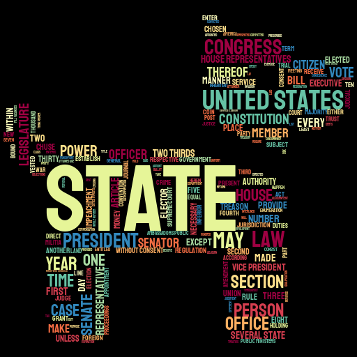
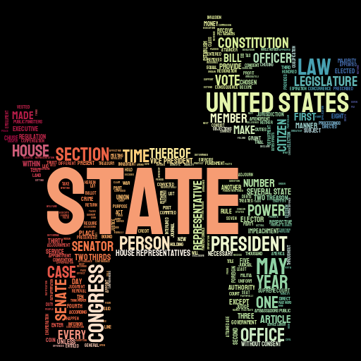

# hello-world

An extremely basic example to demonstrate stylecloud's functionality. For apples-to-apples comparison, it creates a word cloud from the US Constituion as the [world_cloud hello world example](https://github.com/amueller/word_cloud/blob/master/examples/simple.py) does.

## Base stylecloud: text input only


The quickest way to create a stylecloud with no configuration:

Python:

```python
import stylecloud

stylecloud.gen_stylecloud(file_path='constitution.txt')
```

CLI:

```sh
stylecloud --file_path constitution.txt
```

## Customize Icon, Palette, and Background



You can change the icon, palette, and background to increase style.

Python:

```python
import stylecloud

stylecloud.gen_stylecloud(file_path='constitution.txt',
                          icon_name='fas fa-dog',
                          palette='colorbrewer.diverging.Spectral_11',
                          background_color='black')
```

CLI:

```sh
stylecloud --file_path constitution.txt --icon_name 'fas fa-dog' --palette colorbrewer.diverging.Spectral_11 --background_color black
```

## Add a gradient



Specifying a gradient direction (`horizontal` or `vertical`) will cause the words to behave as if affected by a color gradient.

It is strongly recommended you use the nondefault palette if adding a gradient.

Python:

```python
import stylecloud

stylecloud.gen_stylecloud(file_path='constitution.txt',
                          icon_name='fas fa-dog',
                          palette='colorbrewer.diverging.Spectral_11',
                          background_color='black',
                          gradient='horizontal')
```

CLI:

```sh
stylecloud --file_path constitution.txt --icon_name 'fas fa-dog' --palette colorbrewer.diverging.Spectral_11 --background_color black --gradient horizontal
```

