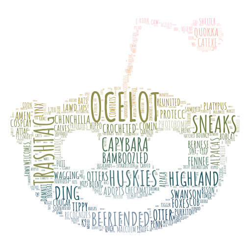

# reddit



A word cloud of the top words used on [Reddit](https://www.reddit.com) in 2019 with a twist; instead of sizing the words based on counts and averages (which rewards spam and and is not reflective of typical Reddit viewing), it uses the 90th score quantile of submissions containing that word, among curated subreddits.

The BigQuery in `reddit_top_words_simple.sql` will return a 2,000 row CSV of these top words (`reddit_top_words_simple.csv`). A more-correct implementation that scores words from the Top 100 subreddits (by unique submitters) is available in `reddit_top_words.sql` and `reddit_top_words.csv`, however those turned out to be more *problematic* than expected and it would not be a good idea to visualize them!

We can use the famous fun font [Amatic SC](https://fonts.google.com/specimen/Amatic+SC) as well.

CLI command:

```sh
stylecloud --file_path reddit_top_words_simple.csv --icon_name 'fab fa-reddit-alien' --palette scientific.sequential.Batlow_20_r --gradient vertical --font_path AmaticSC-Bold.ttf
```
